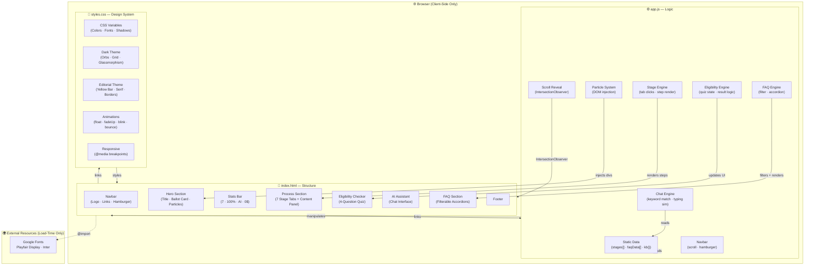

# 🗳️ ElectEd — Your Interactive Election Process Guide

> **Non-partisan civic education, reimagined.** ElectEd is a beautifully designed, fully interactive web application that walks every citizen through the complete election process — from voter registration to inauguration — with zero jargon and 24/7 AI support.

---

## 📌 Project Overview

ElectEd was built for **Challenge 2 of Promt Wars** with a single mission: make democracy understandable for everyone. It blends two distinct design languages — a **dark, atmospheric sci-fi UI** and a **bold editorial newspaper style** — into one unique, premium experience.

The app requires no backend, no database, and no login. It runs entirely in the browser as a single HTML page powered by vanilla CSS and JavaScript.

---

## ✨ Features

| Feature | Description |
|---|---|
| 🌑 **Hybrid Dark/Editorial UI** | Seamlessly blends dark glassmorphism (purple/teal glows, particles) with bold serif editorial design (yellow stats bar, orange CTAs, thick black borders) |
| 🗓️ **7-Stage Interactive Timeline** | Numbered tabs (01–07) covering every election phase: Registration → Nomination → Campaigns → Early Voting → Election Day → Counting → Certification |
| 📋 **Step-by-Step Stage Detail** | Click any stage to reveal 4 actionable steps with animated hover effects |
| ✅ **Voter Eligibility Checker** | 4-question guided quiz with progress bar that determines if a user is eligible to vote and explains why/why not |
| 🤖 **AI-Powered Chat Assistant** | Keyword-based knowledge assistant covering 20+ election topics — works offline, no API key needed |
| ❓ **Filterable FAQ** | 10+ Q&As organised by category: Registration, Voting, Candidates, Results |
| 🎬 **Animated Hero Section** | Floating ballot card, rising particles, glowing orbs, scroll-triggered reveal animations |
| 📊 **Stats Bar** | Eye-catching yellow bar (7 stages · 100% Non-Partisan · AI Tutor · Free) |
| 📱 **Fully Responsive** | Mobile-first layout with hamburger navigation, responsive grids, and touch-friendly buttons |
| ♿ **Accessible** | Semantic HTML5, ARIA labels on all interactive elements, keyboard-navigable FAQ and chat |
| 🔒 **Privacy-First** | Zero data collection, no cookies, no external API calls at runtime |

---

## 🏗️ Architecture



---

## 🛠️ Technology Stack

| Layer | Technology | Purpose |
|---|---|---|
| **Structure** | HTML5 (Semantic) | Page layout, ARIA accessibility |
| **Styling** | Vanilla CSS3 | Design system, animations, responsive grid |
| **Logic** | Vanilla JavaScript (ES6+) | All interactivity — no frameworks |
| **Typography** | Google Fonts | Playfair Display (serif headlines) + Inter (body) |
| **Animations** | CSS Keyframes + JS IntersectionObserver | Particles, float, fade-up, scroll-reveal |
| **Icons** | Unicode Emoji | Zero-dependency iconography |
| **Version Control** | Git | Source history |

> **Zero runtime dependencies.** No React, no Vue, no jQuery, no npm packages required.

---

## 📁 Project Structure

```
election/
│
├── index.html        # Single-page app structure & all sections
├── styles.css        # Complete design system (650+ lines)
├── app.js            # All interactivity & data (350+ lines)
└── README.md         # This file
```

---

## 🎨 Design Language

ElectEd is a deliberate fusion of two visual worlds:

**Dark Atmospheric UI** (from UI v1)
- Deep navy background (`#08091a`) with glowing purple/teal orbs
- Glassmorphism cards with gradient borders and glow shadows
- Rising particle animations and grid overlay
- Gradient text (`linear-gradient(purple → teal)`)

**Editorial Newspaper Style** (from UI v2)
- Playfair Display serif for all major headings
- Vivid yellow (`#F5D90A`) stats bar with diagonal hatching
- Orange (`#E8400C`) CTAs with thick black (`#000`) borders
- Cream (`#F4F1EC`) sections for high contrast with dark segments

---

## 🤖 How the AI Assistant Works

The assistant uses **client-side keyword matching** against a curated knowledge base of 20+ election topics. No API calls are made at runtime.

```
User Input → toLowerCase() → keyword scan (kb object) → matched response
                                        ↓ no match
                                   default response
```

**Covered topics:** registration, eligibility, voting, mail/absentee ballots, election day, vote counting, the Electoral College, primaries, candidate filing, campaign rules, recounts, certification, inauguration, and dispute resolution.

---

## 🚀 How to Run

No build step, no server required.

```bash
# Option 1: Open directly
# Double-click index.html in your file explorer

# Option 2: Local dev server (optional, for live reload)
npx serve .
# or
python -m http.server 8080
```

Then visit `http://localhost:8080` in your browser.

---

## 📸 Sections at a Glance

| # | Section | What It Does |
|---|---|---|
| 1 | **Hero** | Bold serif headline, animated ballot card, particle field |
| 2 | **Stats Bar** | Yellow editorial bar — 4 key facts |
| 3 | **7-Stage Timeline** | Click any tab to explore that election stage |
| 4 | **Eligibility Checker** | Quiz with 4 yes/no questions + instant result |
| 5 | **AI Assistant** | Type or click starter questions for instant answers |
| 6 | **FAQ** | Filter by category, click to expand |
| 7 | **Footer** | Brand + privacy note |

---

## 🏆 Built For

> **Promt Wars — Challenge 2**
> *"Create an assistant that helps users understand the election process, timelines, and steps in an interactive and easy-to-follow way."*

---

*© 2026 ElectEd — Built for civic education. Not affiliated with any government body. 🔒 No personal data stored.*